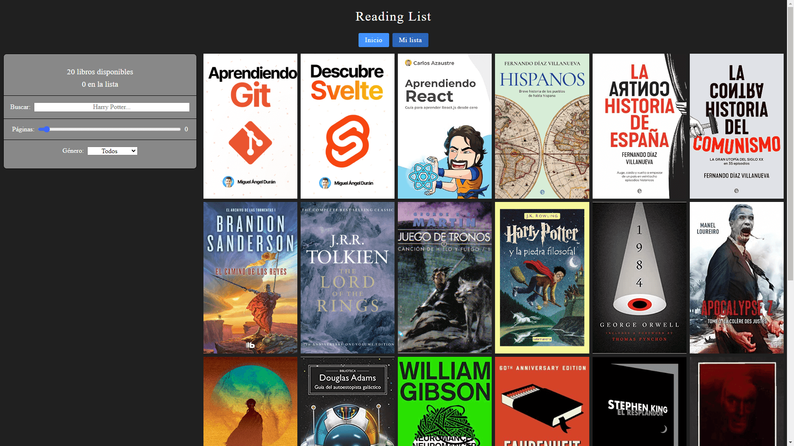

# 01 - Lista de lectura

Esta es la primera prueba tecnica que consiste en una lista de lectura en la que el usuario puede guardar en una lista los libros que seleccione de los libros disponibles.

| [Ir al despliegue](https://jaamdev.github.io/prueba-reading-list/) | [Ir a la web de los retos](https://pruebastecnicas.com) | [Ir al repositorio de los retos](https://github.com/midudev/pruebas-tecnicas/tree/main/pruebas/01-reading-list) |
| :-: | :-: | :-: |

## Scripts

```bash
# instalar las dependencias
npm i
# iniciar el proyecto
npm run dev
```

## Vista


## Requisitos

1. **Visualización de Libros Disponibles**: La aplicación debe mostrar una lista de libros disponibles que el usuario pueda revisar.

2. **Creación de Lista de Lectura**: El usuario debe ser capaz de crear una lista de lectura a partir de los libros disponibles. En la UI debe quedar claro qué libros están en la lista de lectura y cuáles no. También debe ser posible mover un libro de la lista de lectura a la lista de disponibles.

3. **Filtrado de Libros por Género**: Los usuarios deben poder filtrar la lista de libros disponibles por género, y se mostrará un contador con el número de libros disponibles, el número de libros en la lista de lectura y el número de libros disponibles en el género seleccionado.

4. **Sincronización de Estado**: Debe haber una sincronización del estado global que refleje el número de libros en la lista de lectura y el número de libros todavía disponibles. Si un libro se mueve de la lista de disponibles a la lista de lectura, el recuento de ambos debe actualizarse en consecuencia.

5. **Persistencia de Datos**: La aplicación debe persistir los datos de la lista de lectura en el almacenamiento local del navegador. Al recargar la página, la lista de lectura debe mantenerse.

6. **Sincronización entre pestañas**: Si el usuario abre la aplicación en dos pestañas diferentes, los cambios realizados en una pestaña deben reflejarse en la otra. Sin necesidad de usar Backend.

7. **Despliegue**: La aplicación debe estar desplegada en algún servicio de hosting gratuito (Netlify, Vercel, Firebase, etc) y debe ser accesible a través de una URL pública. Indica la URL en el README.

8. **Test**: La aplicación debe tener AL MENOS un test. Haz el test que consideres más importante para tu aplicación.
